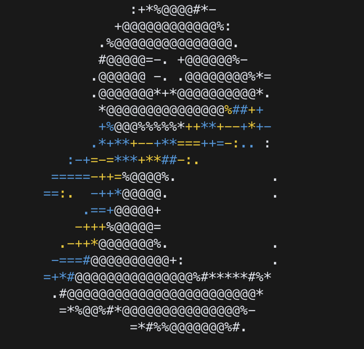

<center>
    <h1>OCF Neofetch ASCII</h1>
    <p>Yes, by hand :')</p>
    
    <br>
</center>

## Usage

Config in `~/.config/neofetch/config.conf`

```
image_source="$(cat ~/opt/waddles-ascii)"
```

